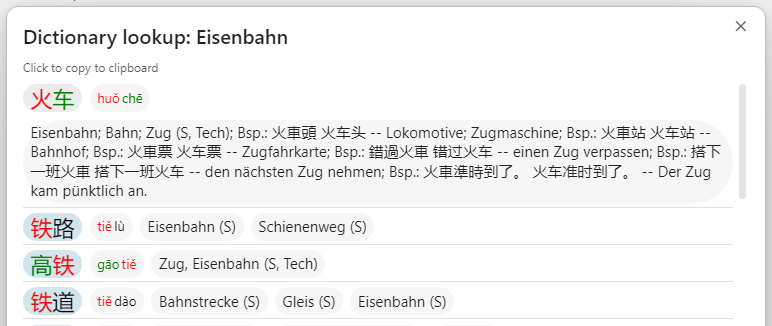

# Mandarin Helper

Mandarin Helper is an [Obsidian](https://obsidian.md) community plugin for reading and looking up Chinese text inside your notes.

It adds pinyin above Hanzi in reading and editing views, colorizes tones, and provides a built-in dictionary lookup popup that works from the keyboard or the sidebar.

## Features

### Hanzi Annotation


- Render pinyin transliterations above Hanzi in reading mode
- Show pinyin annotations directly in the editor
- Color Hanzi and pinyin by tone
- Adjust the display scale for Hanzi and pinyin
- Download and load a local dictionary from a configurable source
- Look up the current selection or, if nothing is selected, the current line

### Dictionary Lookup

This plugin supports loading dictionaries in a [CEDICT](https://en.wikipedia.org/wiki/CEDICT) compatible format. After installation, provide the URL of the raw dictionary and press "Download" in the settings. URLs for English-Chinese and German-Chinese dictionaries are pre-provided.



- Open dictionary results from:
  - the `Dictionary Lookup` command
  - a configurable hotkey
  - the sidebar ribbon button with the `book-a` icon
- Copy Hanzi, pinyin, or translations from the popup with one click

Dictionary lookup searches against:

- Hanzi
- normalized pinyin
- normalized translation text

Matches are shown in a popup with:

- Hanzi
- pinyin
- translations

Each segment in the popup is clickable. Clicking a segment copies its contents to the clipboard, closes the popup, and shows feedback about what was copied.

If no text is selected when lookup is triggered, the plugin falls back to the current editor line and strips common Markdown syntax such as headings, list markers, checkboxes, and links before searching.

## Settings

Mandarin Helper currently provides these settings:

- `Display Pinyin`
- `Colorize by tone`
- `Dictionary source`
- `Increase font size`
- custom colors for tones 1 through 5

The dictionary source field is empty by default.

Use the `English` or `German` button in settings to fill in a preset dictionary URL, or paste your own source manually. The `Download` button fetches the dictionary and stores it locally for the plugin. The source can point directly to a `.u8` file or to a `.zip` archive that contains one.

## Installation

### Manual installation

#### Desktop

Copy these files into your vault at:

`.obsidian/plugins/mandarin-helper/`

Files:

- `main.js`
- `manifest.json`
- `ranking.json`
- `styles.css`

Then reload Obsidian and enable **Settings → Community plugins → Mandarin Helper**.

#### Android

To install the plugin manually on Android:

1. Download or copy these files to your Android device:
   - `main.js`
   - `manifest.json`
   - `ranking.json`
   - `styles.css`
2. Open your vault folder in an Android file manager. This is the folder that contains your notes and the hidden `.obsidian` directory.
3. If needed, enable hidden files in the file manager so `.obsidian` is visible.
4. Create this folder inside the vault if it does not already exist:

   `.obsidian/plugins/mandarin-helper/`

5. Copy the four plugin files directly into that folder.
6. Fully close and reopen Obsidian on Android.
7. In Obsidian, go to **Settings → Community plugins**, disable safe mode if needed, and enable **Mandarin Helper**.

If the plugin does not appear, make sure the folder is named exactly `mandarin-helper` and that the files are not inside an extra nested folder from the archive extraction.

## Development

### Requirements

- Node.js 18+
- npm

### Setup

```bash
npm install
```

### Start watch build

```bash
npm run dev
```

### Production build

```bash
npm run build
```

### Run tests

```bash
npm test
```

### Lint

```bash
npm run lint
```

## Project Structure

```text
src/
  commands/      # command registration and lookup triggering
  editor/        # editor decorations for pinyin and tone coloring
  hanzi/         # Hanzi annotation helpers
  rendering/     # reading-view post processing
  ui/            # modal UI for dictionary lookup
  dictionary.ts  # dictionary parsing, normalization, matching
  main.ts        # plugin lifecycle
  settings.ts    # settings model and settings tab
```

## Notes

- The plugin is intended to work offline after the dictionary has been downloaded.
- Dictionary data is stored in the plugin's data directory inside `.obsidian/plugins/mandarin-helper/data/`.
- `ranking.json` is a bundled plugin asset and should be shipped alongside `main.js`, `manifest.json`, and `styles.css` when publishing releases or installing manually.
- The plugin is currently marked as mobile-compatible in `manifest.json`.

## Third-party libraries

Mandarin Helper uses [`pinyin-pro`](https://github.com/zh-lx/pinyin-pro) for Hanzi-to-Pinyin conversion and related pinyin normalization. `pinyin-pro` is created by `zh-lx` and distributed under the MIT License.

See `THIRD_PARTY_NOTICES.md` for the full license notice included for this dependency.


## License

`0BSD`
